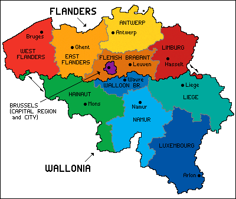
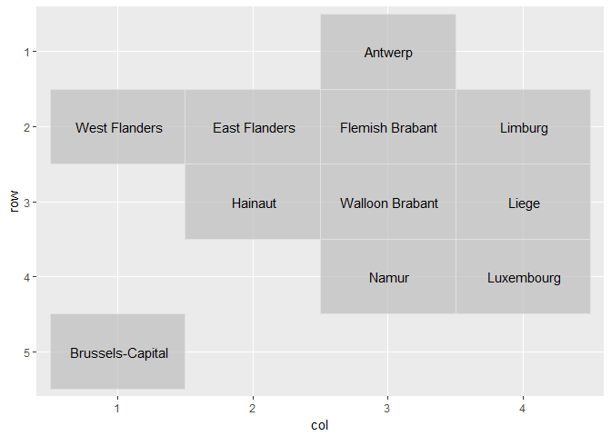
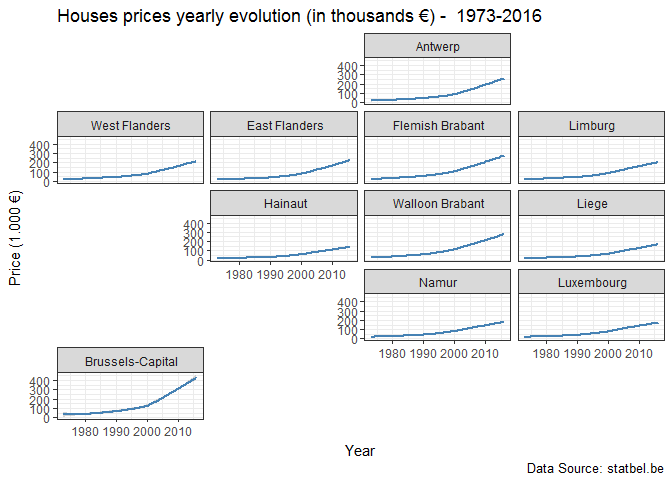

README
================
WeLoveDataScience
2017-07-28

geo\_facet
----------

> The geofacet R package provides a way to flexibly visualize data for different geographical regions by providing a ggplot2 faceting function `facet_geo()` which works just like ggplot2’s built-in faceting, except that the resulting arrangement of panels follows a grid that mimics the original geographic topology as closely as possible.

For more information on this exciting package, see <https://hafen.github.io/geofacet/>.

This repository is a quick demonstration on how to use `geo_facet` with a specific map created by WeLoveDataScience for Belgium (provinces + Brussels level).

We take as example data real estate prices evolution over more than 40 years in Belgium (open data provided by Belgium government).

Belgium map
-----------

### Our point of comparison



### geofacet map

Here is what we propose as corresponding geo-facet map:

``` r
library(geofacet)
```

    ## Warning: package 'geofacet' was built under R version 3.3.3

``` r
library(ggplot2)
bemap <- read.csv("geofacet_be_map.csv")
grid_preview(bemap,label="name_EN")
```

    ## You provided a user-specified grid. If this is a generally-useful
    ##   grid, please consider submitting it to become a part of the
    ##   geofacet package. You can do this easily by calling:
    ##   grid_submit(__grid_df_name__)



Example of usage
----------------

Let's import some open data from Belgium government. Those are data about real estates prices evolution over more than 40 years in Belgium (houses, flats...).

``` r
library(rio)
library(dplyr)
```

    ## 
    ## Attaching package: 'dplyr'

    ## The following objects are masked from 'package:stats':
    ## 
    ##     filter, lag

    ## The following objects are masked from 'package:base':
    ## 
    ##     intersect, setdiff, setequal, union

``` r
# Import data at Region level (for Brussels Capital region)
t1=tempfile(fileext=".zip")
data1.link= "http://statbel.fgov.be/fr/binaries/immo_by_region_tcm326-283164.zip"
download.file(data1.link,t1,mode="wb",quiet=TRUE)
unzip(t1)
data1 <- import("immo_by_region.txt")
file.remove(t1)
```

    ## [1] TRUE

``` r
# filter region data: keep only Brussels and Yearly data
data1 <- filter(data1,CD_PERIOD=="Y" & CD_REFNIS=="4000")


# Import data at Region level (for Brussels Capital region)
t2=tempfile(fileext=".zip")
data2.link= "http://statbel.fgov.be/fr/binaries/immo_by_province_tcm326-283148.zip"
download.file(data2.link,t2,mode="wb",quiet=TRUE)
unzip(t2)
data2 <- import("immo_by_province.txt")
file.remove(t2)
```

    ## [1] TRUE

``` r
# filter province  data: keep only  Yearly data
data2 <- filter(data2,CD_PERIOD=="Y")

# Append data
data <- rbind(data1, data2)
data$code_NIS5 = data$CD_REFNIS
data$MS_MEAN_PRICE_1K = round(data$MS_MEAN_PRICE/1000,1)
```

#### Average houses prices evolution per province

Let's focus on houses

``` r
houses <- filter(data, CD_TYPE_FR=="maisons d'habitation")

g<-ggplot(houses, aes(x=CD_YEAR, y=MS_MEAN_PRICE_1K))+
    geom_smooth(color="steelblue")
g <- g+facet_geo(~code_NIS5,grid=bemap, label="name_EN")
```

    ## You provided a user-specified grid. If this is a generally-useful
    ##   grid, please consider submitting it to become a part of the
    ##   geofacet package. You can do this easily by calling:
    ##   grid_submit(__grid_df_name__)

``` r
g <- g+labs(title = paste("Houses prices yearly evolution (in thousands €) - ",paste(range(houses$CD_YEAR),collapse="-")),
    caption = "Data Source: statbel.be",
    x = "Year",
    y = "Price (1.000 €)") +
  theme_bw()

g
```

    ## `geom_smooth()` using method = 'loess'


